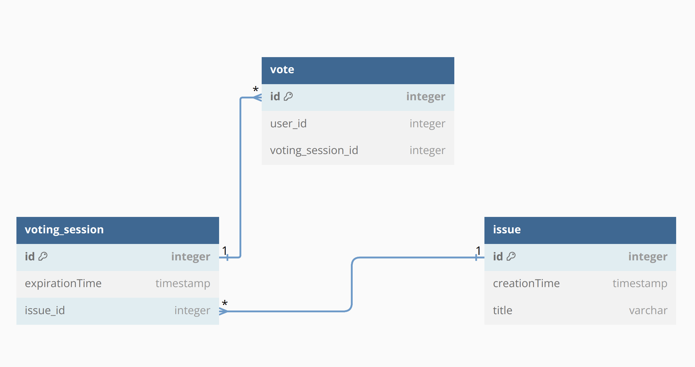

# Assembly project

## Description
This project is a simple assembly project where users will be able to vote for an assembly and start a new one.   

This project is powered by:
- [Java](https://www.java.com/)
- [PostgresSQL](https://www.postgresql.org/)
- [Spring Boot](https://spring.io/projects/spring-boot)
- [Docker](https://www.docker.com/)
- [Docker Compose](https://docs.docker.com/compose/)
- [Gradle](https://gradle.org/)
- [Project Lombok](https://projectlombok.org/)

## About the database
The database is a simple PostgresSQL database with three tables (these can be found on the `src/main/resources/db/sql` folder):
- issue
- voting_session
- vote



## AWS
This project is deployed on AWS using CDK, AWS fargate, AWS ECS, and AWS RDS. The project is available [here](http://Assemb-assem-hh0W57HyCOqx-1476110986.sa-east-1.elb.amazonaws.com/actuator/health).

A new DNS for the project was not configured due to pricing as well as the TSL/SSL certificate for HTTPS requests.

The cloud development is only for demonstration purpose and should not be used in production.

## How to run locally
First of all, this project is written using Java version 21. Please, make sure you're using the correct java version.
```
$ java --version
```
If you're not using the correct version, please install it. You can use [SDKMAN](https://sdkman.io/) to manage your java versions.

Please, for docker, you can install the latest version of docker and docker-compose. You can follow the instructions on the official website.

Don't worry about gradle version, for this project a wrapper is configured which will be used to run all gradle commands from the CLI.

### Running
To run the project, first you must run the docker compose file with:
```
$ docker-compose up -d
```
Please, note that removing the -d flag, the container will start and log everything on the terminal. My suggestion is to use the -d flag to ensure that the container is running on the background.

After running the docker compose file, you can run the project using the following command:
```
$ SPRING_PROFILES_ACTIVE=local ./gradlew bootRun
```

### Swagger API

After running the project, you can access the swagger API on the following URL:
```
http://localhost:8080/swagger-ui.html
```

### Testing
This project uses JUnit 5 for testing. You can run the tests using the following command:
```
$ ./gradlew cleanTest test
```
This is configured to display the test results on the terminal as 'passed', 'failed' or 'skipped'.

#### Using pgAdmin
After running the docker compose file, a container for the pgAdmin will be created. You can easily access it through the localhost:5050.
pgAdmin default credentials are:
- email: test@test.com
- password: test

After logging in, a server will be automatically created. You can access it using the following password:
- password: postgres
